<picture>
  <source media="(prefers-color-scheme: dark)" srcset="assets/header-dark.svg">
  
</picture>

  <a href="https://asongjr.com">Portfolio</a> &nbsp;&nbsp;/&nbsp;&nbsp;
  <a href="https://linkedin.com/in/asongsuhjr/">LinkedIn</a> &nbsp;&nbsp;/&nbsp;&nbsp;
  <a href="https://drive.google.com/file/d/1OwA_MD_i5aA4ZWf6BAb8sa-ZQBFraLYQ/view?usp=sharing">Resume</a>

Open to Summer 2027 internships in SWE, applied AI, and ML.

 

## Experience

<picture>
  <source media="(prefers-color-scheme: dark)" srcset="assets/timeline-dark.svg">
  
</picture>

### Sand Technologies
Research Engineer Intern, Healthcare Science &nbsp;/&nbsp; Kigali and Cape Town &nbsp;/&nbsp; May to Aug 2026

- Migrated a 3-stage computer vision pipeline (YOLOv5 detection, 72M-param multi-scale attention transformer, verdict CNN) from TensorFlow 1.x to PyTorch, matching published benchmarks at 0.998 AUC, and fixed a Grad-CAM gradient bug corrupting 40% of interpretability outputs
- Diagnosed a distribution shift that dropped AUC to 0.40 on unseen capture hardware; designed replay-based fine-tuning across 6 datasets that recovered AUC to 0.93 without catastrophic forgetting
- Built and trained a second YOLOv8 detection pipeline on cloud GPUs, reaching ~100% sensitivity and 0.97 specificity in held-out evaluation
- Shipped 12 offline-first Python/FastAPI microservices for field deployment, with an encrypted event-sourced datastore, on-device Whisper speech-to-text, and signed model distribution

### Google
Software Engineering Intern, Apigee Observability &nbsp;/&nbsp; Sunnyvale, CA &nbsp;/&nbsp; May to Aug 2025

- Built 12 ML anomaly detection and failure-pattern systems on large-scale API behavioral telemetry, giving Apigee contextual visibility into API performance and groundwork for predictive reliability tooling across Google Cloud
- Built a dual-mode retrieval-augmented generation framework that combines vector semantic search with large-scale historical data retrieval, cutting data retrieval latency and cloud spend
- Designed high-throughput, low-latency inference and evaluation pipelines (BigQuery pulls, retrieval paths) and load-simulation tooling that raised failure-mode coverage by 80%
- Wrote a Python API traffic generator that simulates multi-dimensional usage patterns for stress testing future Google Cloud products
- Contributed ~4,500 lines across Python, Go, and Java inside the Google Cloud codebase, working through daily stand-ups, code reviews, and design reviews

 

## Research & applied research

### [se3env](https://github.com/asoncode/se3env)
An RL environment for 3D geometric reasoning with provably correct answers, built to test whether models learn the geometry or learn to game the grader.

<a href="https://github.com/asoncode/se3env">
<picture>
  <source media="(prefers-color-scheme: dark)" srcset="assets/se3env-dark.svg">
  
</picture>
</a>

Details

 

- Six task families from one scene model, from visibility checks to loop-closure residuals over chained 4x4 transforms
- Difficulty measured as distance from the decision boundary; instances that flip under rounding are filtered out
- Seven distribution-shift configs, 260 tests, and a GRPO training script via TRL

### [Invisible Machine](https://github.com/asoncode/InvisibleMachine)
An agent pushes on a simulated device it can't see inside, infers the hidden spring network, and predicts what the next push will do.

<a href="https://github.com/asoncode/InvisibleMachine">
<picture>
  <source media="(prefers-color-scheme: dark)" srcset="assets/invisible-machine-dark.svg">
  
</picture>
</a>

Details

 

- MuJoCo simulator with noisy telemetry, 37 topologies, and 560 stiffness assignments split by topology
- Compares Bayesian grammar search, a learned proposal model, a direct predictor, and linear system identification
- Frozen 144-episode study with an 11-page technical paper and an interactive React lab

### [OrfaLens](https://github.com/asoncode/OrfaLens)
Builds a persistent, object-aware 3D map from a single RGB camera.

<a href="https://github.com/asoncode/OrfaLens">
<picture>
  <source media="(prefers-color-scheme: dark)" srcset="assets/orfalens-dark.svg">
  
</picture>
</a>

Details

 

- ORB visual odometry, MiDaS depth with temporal scale stabilization, and keyframe-anchored point-cloud fusion
- YOLOv8 or RT-DETR detection with motion-plus-appearance 3D tracking
- Loop closure with pose-graph optimization, relocalization, and `.ply` export

### [SafetAI](https://www.linkedin.com/in/asongsuhjr/details/projects/)
Real-time active shooter detection for schools, hospitals, and airports, using audio, video, and super-resolution models.

<a href="https://www.linkedin.com/in/asongsuhjr/details/projects/">
<picture>
  <source media="(prefers-color-scheme: dark)" srcset="assets/safetai-dark.svg">
  
</picture>
</a>

Details

 

- Audio CNN (TensorFlow) that classifies gunshots and estimates distance, trained on 13,973 clips
- YOLOv5 + ByteTrack detector for open-carried firearms and their holders, trained on 16,322 images
- ESRGAN upscaling of surveillance footage for detection and forensic review
- Congressional App Challenge winner (TX-8), 2x SCI://TECH 1st place, 2x Repsol Student Innovation Award

 

## Projects

| | |
|---|---|
| **[FPL AI Command Center](https://github.com/asoncode/FPL-Assistant)** | Forecasts Fantasy Premier League points and solves transfers as a mixed-integer program under every FPL rule |
| **[Health Bulletin System](https://github.com/asoncode/Neonatal_Dashboard)** | Turns health facility data into a dashboard, PDF bulletin, and Excel workbook from one metrics layer |
| **[LipTr](https://github.com/asoncode/Lip-Reader)** | Transcribes speech from video using lip movement alone, no audio |
| **[Question Creator](https://github.com/asoncode/QuestionCreator)** | Turns study notes or code into practice questions with a local code runner |

 

## Credentials

**Congressional Commendation, U.S. House of Representatives** 
Recognized by the U.S. House after SafetAI won the Congressional App Challenge for Texas's 8th District.

**NSBE 25 Under 25, Inaugural Class of 2026** 
Named to the National Society of Black Engineers' first 25 Under 25 class, which recognizes students and young professionals for impact and leadership in STEM, research, and innovation.

 

## Tools

Python, C++, TypeScript, SQL &nbsp;/&nbsp; PyTorch, OpenCV, NumPy, SciPy, MuJoCo &nbsp;/&nbsp; FastAPI, PostgreSQL, React, Docker
