  

  
  
  
  

I build systems that work out the physical world from very little signal: one camera, a few pushes on a hidden mechanism, a microphone in a hallway. Lately that means RL environments whose rewards can be checked instead of trusted, and mapping systems that remember where things are. I'm looking for Summer 2027 internships in SWE, applied AI, ML, and research engineering.

## Research & applied research

### [se3env](https://github.com/asoncode/se3env)

Does a model trained on verifiable rewards learn the geometry, or learn the verifier? se3env generates SE(3) reasoning problems whose answers are closed-form, then attacks its own grader to find out.

How it works

 

- Six task families built from one scene model (camera poses, landmarks, pinhole intrinsics), from visibility and depth order up to loop-closure residuals that require chaining 4x4 transforms
- Difficulty is a margin from the decision boundary, not a label, so accuracy can be plotted against how close each instance is to flipping
- A precision filter recomputes every instance from its own rounded inputs and drops the ones whose answer moves
- Seven generator configs for distribution shift, including rescaled scenes and quaternion rotations that change every number while provably keeping the answer
- The adversarial probe suite caught a real bug in the original strict verifier: scoring the last answer tag let a policy that lists every option collect exactly chance
- GRPO training script via TRL; evaluation is always strict across all configs

### [Invisible Machine](https://github.com/asoncode/InvisibleMachine)

An agent pushes on a simulated mechanical device it can't see inside, keeps a weighted set of guesses about the hidden spring network, and predicts what the next push will do.

How it works

 

- MuJoCo mechanisms with persistent state, force commands, noisy telemetry, and clone and replay
- Benchmark of 37 spring-network topologies and 560 stiffness assignments, split at the topology level into train, development, and test
- Compares finite Bayesian agents, grammar search, a learned recurrent proposal model, a direct response predictor, and continuous linear system identification
- Frozen final study: 144 episodes across 8 held-out families with zero failures, family-bootstrap confidence intervals, and calibration diagnostics
- The honest result: learned proposals were 15.6% lower on average but not reliably better, and the simple linear baseline won
- Ships with an 11-page technical paper and a React lab for probing the machine by hand

### [OrfaLens](https://github.com/asoncode/OrfaLens)

The system behind Orfa.ai. A single RGB video stream goes in; a persistent, object-aware 3D map comes out, one you can save, reload, and relocalize against later.

How it works

 

- ORB visual odometry with geometric pose recovery
- MiDaS learned depth with temporal scale-and-shift stabilization to stop scale flicker before fusion
- Point-cloud fusion in keyframe-anchored chunks, so the map moves consistently when poses are optimized
- YOLOv8 or RT-DETR detection with motion-plus-appearance 3D tracking for stable object identities
- Loop closure with pose-graph optimization, descriptor-based relocalization, and `.ply` export

### [SafetAI](https://www.linkedin.com/in/asongsuhjr/details/projects/)

Active shooter detection for schools, hospitals, and airports, where nobody on site is armed and minutes matter. Three real-time models, started in 2022 at the Conroe ISD Academy of Science and Technology.

How it works, and what it won

 

- Audio CNN (TensorFlow) that classifies gunshots and estimates their distance, trained on 13,973 clips
- YOLOv5 + ByteTrack detector for open-carried firearms and the person holding them, trained on 16,322 images
- ESRGAN super-resolution on surveillance footage to improve detection input and forensic review
- Congressional App Challenge winner (TX-8) and a Commendation from the U.S. House of Representatives
- 2x SCI://TECH Robotics & Intelligent Machines 1st place, 2x Repsol Student Innovation Award, HCU Cyber Impact Award, Dilorio Foundation Senior Engineering 1st place

## Experience

**Sand Technologies** / Research Engineer Intern, Healthcare Science / Kigali and Cape Town / May to Aug 2026
- Migrated a 3-stage computer vision pipeline (YOLOv5 detection, 72M-param multi-scale attention transformer, verdict CNN) from TensorFlow 1.x to PyTorch, matching published benchmarks at 0.998 AUC; debugged a Grad-CAM gradient bug corrupting 40% of interpretability outputs
- Diagnosed distribution shift dropping AUC to 0.40 on unseen capture hardware across 6 datasets and 4 annotation formats; designed replay-based fine-tuning that recovered AUC to 0.93 without catastrophic forgetting
- Built and trained a second YOLOv8 detection pipeline on cloud GPUs, reaching ~100% sensitivity and 0.97 specificity in held-out evaluation
- Shipped 12 offline-first Python/FastAPI microservices for field deployment: event-sourced encrypted datastore (AES-SIV), on-device Whisper speech-to-text, idempotent delivery, Ed25519-signed model distribution, SHA-256 weight verification

**Google** / SWE Intern, Apigee Observability / Summer 2025
- Built 12 ML anomaly detection systems on API data
- Designed low-latency inference pipelines
- Improved failure-mode coverage by 80%

## Projects

| | What it does | Built with |
|---|---|---|
| **[FPL AI Command Center](https://github.com/asoncode/FPL-Assistant)** | Forecasts Fantasy Premier League points over a 1 to 8 gameweek horizon, then solves transfers as a mixed-integer program under every FPL rule, with exact lineup selection and a chip advisor that defaults to holding | FastAPI, SciPy MILP, React, TypeScript, Docker |
| **[Health Bulletin System](https://github.com/asoncode/Neonatal_Dashboard)** | Turns DHIS2-style facility data into a dashboard, a PDF bulletin, and an Excel workbook from one metrics layer, aimed at a Ministry of Health process that took about 40 hours a month by hand; the LLM only ever sees computed metrics | PostgreSQL, pandas, Streamlit, WeasyPrint, OpenAI |
| **[LipTr](https://github.com/asoncode/Lip-Reader)** | Reads lips from video with no audio: finds the face, crops the mouth, runs a pretrained conformer, then an LLM pass rebuilds plausible sentences | auto_avsr, MediaPipe, PyTorch |
| **[Question Creator](https://github.com/asoncode/QuestionCreator)** | Turns pasted notes or code into coding, debugging, and trace-output questions, with a local runner that checks your answers | Python stdlib, vanilla JS, OpenAI |
| **Quant trading system** | Autonomous execution and risk agents with volatility-based portfolio allocation | Python |

## Toolbox

  
  
  
  
  
  
  
  
  
  
  
  
  

Computer vision, SLAM, RL environments and verifiers, optimization, and ML systems.

## Recognitions

- NSBE 25 Under 25
- Congressional App Challenge winner and U.S. House Commendation
- Y Combinator AI Startup School and Summer Conference invitee
- Texas A&M Student Research Week, top 3 in CS
